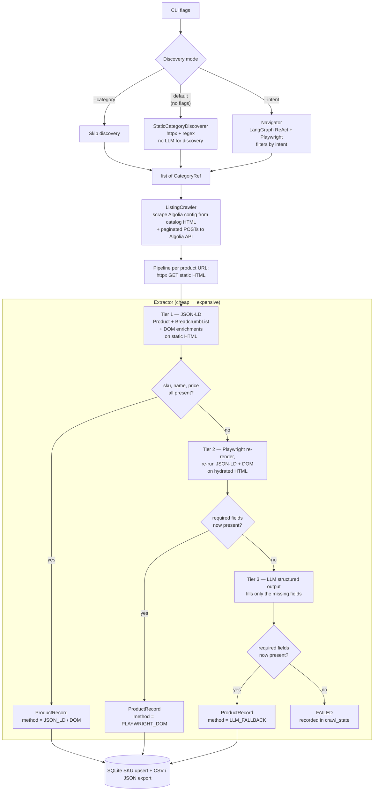

# Frontier Dental — Safco Scraping Agent (POC)

A 24-hour proof-of-concept agent-based product catalog scraper for
[Safco Dental Supply](https://www.safcodental.com).

The pipeline is **deterministic by default** and reaches for the LLM only
where judgment matters:

- **Static discovery (default)** — `httpx` GET on the storefront landing
  page + regex over `/catalog/<slug>` links. No browser, no LLM, no cost.
- **LLM Navigator (`--intent`)** — a LangGraph ReAct agent driving
  Chromium via LangChain Community's Playwright toolkit. Used for
  natural-language intent filtering.

A deterministic listing crawler then turns each category into product
URLs, and a tiered extractor (JSON-LD → Playwright → LLM) produces
validated records persisted to SQLite with SKU-keyed upserts.

---

## Quick start

```bash
# 0. Look at the pre-baked sample first — no setup required.
cat output/products.json | head        # 101 products, all Tier 1 JSON-LD
cat output/products.csv  | head

# 1. Install Python 3.11 + uv (https://docs.astral.sh/uv/), then:
uv sync                                # installs deps into .venv
uv run playwright install chromium     # required for Navigator + Tier 2
cp .env.example .env                   # fill in VLLM_BASE_URL, etc.

# 2. Run one of these:

# (a) Default — deterministic static category discovery.
#     Tier 2 Playwright and Tier 3 LLM remain available as extraction fallbacks.
uv run main.py run

# (b) Natural-language intent — LLM Navigator filters categories
uv run main.py run --intent "i want Sutures & surgical products and gloves"

# (c) Skip discovery — explicit slugs
uv run main.py run --category hemostatics-retraction --category sutures-surgical-products

# (d) Skip Tier 2 Playwright extraction fallback
uv run main.py run --no-playwright

# 3. Inspect & export
uv run main.py status                  # crawl-state + product counts
uv run main.py export --format both    # CSV + JSON
```

The committed sample in [output/](output/) contains **101 products** from
`hemostatics-retraction` and `sutures-surgical-products`: **100% Tier 1
JSON-LD**, with no observed LLM fallback and no observed Tier 2 Playwright
extraction for those records.

---

## Architecture



### Why this shape

Recon of `safcodental.com` (Magento + Vue + Algolia) drove three calls:

1. **Server-rendered nav, JS-rendered listings.** Top-level `/catalog/<slug>`
   links are plain `<a>` tags on the landing page — the no-LLM
   `StaticCategoryDiscoverer` is the cheapest path and the default. Within
   a category, however, the product grid is hydrated client-side from
   Algolia (`magento2-algoliasearch`), so the `ListingCrawler` scrapes the
   inline Algolia config out of the catalog HTML once and paginates via
   direct API calls instead of fighting JS hydration.
2. **Intent filtering is judgment-heavy.** Matching "gloves and surgical
   supplies" against category names is exactly what LLMs are good at, so
   the **Navigator** is engaged only with `--intent`.
3. **PDPs ship rich JSON-LD.** `Product` and `BreadcrumbList` give SKU,
   name, price, currency, availability, brand, image, and breadcrumb
   server-side — Tier 1 alone covers ~95% of records. Tier 2 (Playwright)
   and Tier 3 (LLM) are last resorts. In the committed sample, every
   record was extracted through Tier 1.
4. **No page classifier needed.** Safco's URL shape
   (`/catalog/<slug>` vs `/product/<slug>`) tells the pipeline what kind
   of page it's looking at with 100% reliability, so a classifier agent
   would be pure decoration. On a messier site where URLs don't disclose
   page type, the same browser-driven `Navigator` could double as a
   classifier — let it inspect a page and emit the page-type label
   before dispatching to the right extractor.

The first iteration used [`browser-use`](https://github.com/browser-use/browser-use)
but ran into popup loops, stale-element clicks, and fragile structured-output
validation. LangGraph ReAct + LangChain's Playwright toolkit gave us
explicit named tools, a custom `submit_categories` Pydantic-typed
termination tool, and a configurable recursion limit (`navigator_max_steps`).

### When the agent is overkill

Strictly speaking, **none of the LLM + Playwright stack is required for
this site**. Safco exposes everything we need over plain HTTP:

| Need | Endpoint | Auth |
|---|---|---|
| Top-level categories | `GET /` (parse `<a href="/catalog/...">` from the rendered nav, plus the legacy `/catalog/category/view/s/<slug>/id/<id>/` form) | none |
| Per-category product list | `POST {appId}-dsn.algolia.net/1/indexes/*/queries` with `facetFilters=[["categoryIds:<id>"]]` | search-only `apiKey` is inlined into every catalog page (rotates ~24h) |
| PDP fields | `GET /product/<slug>` → JSON-LD `Product` + `BreadcrumbList` + `window.masterData` are all server-rendered | none |
| Alternative products | `POST commerce.adobe.io/recs/v1/precs/preconfigured` | public `recs_open` key |

Hitting these directly is **roughly 10× faster** than driving Chromium:
one POST per Algolia page (~50–200 ms) vs. one Chromium navigation per
page (~2 s, plus hydration wait). For a 7-page category that's ~1 s of
HTTP vs. ~14 s of browser. PDP extraction has the same shape — httpx +
JSON-LD parse vs. Playwright re-render.

The pipeline keeps two LLM-touching pieces for distinct reasons:
1. **Navigator LLM** — for `--intent` filtering. Mapping "I want gloves
   and surgical supplies" to the right categories isn't a job for regex.
2. **Tier-3 LLM** — for irregular PDPs. When a page is missing JSON-LD
   entirely, ships a malformed `Product` block, or buries the SKU in
   prose / a non-standard attribute table, the LLM extractor reads the
   raw HTML and fills only the fields the deterministic tiers couldn't.

The Tier-2 Playwright re-render path exists in the pipeline as defensive
insurance against future template changes (e.g. if Safco ever moves
JSON-LD or `window.masterData` behind hydration), but in practice it has
never fired on this site — every PDP we've inspected ships its
structured data server-side.

If you're porting this design to a site **without** intent-driven
discovery and **with** uniform server-rendered PDP templates, you can
rip every LLM/Playwright piece out and run the whole pipeline on
httpx + regex.

---

## Components

| Component | File | Responsibility |
|---|---|---|
| **StaticCategoryDiscoverer** | [src/frontier_dental/agents/navigator.py](src/frontier_dental/agents/navigator.py) | Default. `httpx` + regex over `/catalog/<slug>`. No LLM, no Chromium. |
| **Navigator** | same file | LangGraph ReAct agent + Playwright toolkit. Used with `--intent`. Bounded by `NAVIGATOR_MAX_STEPS` (default 60). |
| **ListingCrawler** | same file | `httpx` GET for category HTML, scrape Algolia config/category id, then paginated POSTs to Algolia for product URLs. Deterministic. |
| **Extractor** | [src/frontier_dental/agents/extractor.py](src/frontier_dental/agents/extractor.py) | Tier 1 JSON-LD + DOM enrichments → Tier 2 Playwright re-render → Tier 3 LLM. Each record is tagged with the tier that produced it. |
| **PlaywrightFetcher** | [src/frontier_dental/playwright_fetcher.py](src/frontier_dental/playwright_fetcher.py) | Lazy headless Chromium for Tier 2 PDP re-rendering. Separate browser from Navigator's. |
| **Validator / Deduper** | [src/frontier_dental/agents/validator.py](src/frontier_dental/agents/validator.py) | Standalone dedupe helper preferring deterministic and more complete records. The main persistence path dedupes by SQLite SKU upsert. |
| **Pipeline** | [src/frontier_dental/pipeline.py](src/frontier_dental/pipeline.py) | Orchestrator. Records `DISCOVERED → DONE / FAILED` in `crawl_state`; skips `DONE` on re-run. |
| **HTTP client** | [src/frontier_dental/http_client.py](src/frontier_dental/http_client.py) | `httpx.AsyncClient` + token-bucket rate limit + `tenacity` exponential backoff. |
| **Recs client** | [src/frontier_dental/recs.py](src/frontier_dental/recs.py) | Adobe Commerce `/recs/v1/precs/preconfigured` → `alternative_products`. Failures degrade to empty list. |
| **LLM client** | [src/frontier_dental/llm.py](src/frontier_dental/llm.py) | OpenAI-compatible vLLM client used by Extractor Tier 3. Navigator uses `langchain_openai.ChatOpenAI` against the same endpoint. |
| **Storage** | [src/frontier_dental/storage.py](src/frontier_dental/storage.py) | SQLite `products` (SKU PK) + `crawl_state`. CSV / JSON export. |

---

## Output schema

`ProductRecord` — see [src/frontier_dental/models.py](src/frontier_dental/models.py).

Most Safco PDPs are **grouped products** — one parent SKU with multiple
variants (sizes, colors). Each variant has its own catalog item number
and manufacturer part number, so `ProductRecord` carries `item_numbers`
and `mfr_numbers` as parallel tuples (one entry per variant, in the same
order). Single-variant PDPs yield one-element tuples, so consumers can
treat both shapes uniformly.

| Field | Type | Source |
|---|---|---|
| `sku` | string (PK) | JSON-LD `Product.sku` |
| `item_numbers` | array | DOM (Safco's per-variant item codes) |
| `mfr_numbers` | array | DOM (manufacturer part numbers) |
| `name` | string | JSON-LD |
| `product_url` | string | JSON-LD (falls back to discovered URL) |
| `category_path` | array | JSON-LD `BreadcrumbList` (Home + product trimmed) |
| `brand` | string \| null | `window.masterData.manufacturer_name`, falls back to JSON-LD `Product.brand.name` |
| `price` / `currency` | decimal / string | JSON-LD `Product.offers` |
| `availability` | enum | `InStock` / `OutOfStock` / `PreOrder` / `Discontinued` / `Unknown` |
| `pack_size` | string \| null | Heuristic over `description` (e.g. `"200/box"`) |
| `description` | string | JSON-LD |
| `specifications` | object | DOM (or LLM in Tier 3); usually empty for this site |
| `image_urls` | array | JSON-LD `Product.image` |
| `alternative_products` | array | Adobe Commerce recs API |
| `extracted_at` | ISO timestamp | runtime |
| `extraction_method` | enum | `json_ld` / `dom` / `playwright_dom` / `llm_fallback` |
| `source_category` | string | runtime (slug) |

CSV export flattens `category_path` (`>`-joined), `specifications` (JSON
string), and array fields (pipe-joined). JSON keeps native nesting.

Sample row from [output/products.json](output/products.json):

```json
{
  "sku": "DDAAA",
  "item_numbers": ["2710407", "2710416", "2710422"],
  "mfr_numbers": ["12170M", "12171M", "12172M"],
  "name": "Gingi-Aid Max (blue label)",
  "product_url": "https://www.safcodental.com/product/gingi-aid-reg-max-trade-blue-label",
  "category_path": ["Dental Supplies", "Hemostatics & Retraction", "Retraction cord"],
  "brand": "Gingi-Pak",
  "price": "15.99",
  "currency": "USD",
  "availability": "InStock",
  "pack_size": null,
  "extraction_method": "json_ld",
  "source_category": "hemostatics-retraction"
}
```

---

## Reliability

| Failure | Behavior |
|---|---|
| HTTP 5xx / network | `tenacity` exponential-jitter retry up to `MAX_RETRIES`. After exhaustion → `crawl_state.FAILED` with error message. |
| Rate limiting | Global token bucket capped at `RATE_LIMIT_RPS`. |
| JSON-LD missing/malformed | Tier 1 yields no complete record; Pipeline escalates to Tier 2 when Playwright is enabled. |
| Playwright crash/timeout | Caught and logged. If Tier 2 was enabled and cannot return rendered HTML, the current pipeline marks the URL `FAILED` instead of falling back to static-html LLM extraction. |
| `--no-playwright` extraction fallback | Tier 2 is skipped; if Tier 1 is incomplete, Tier 3 LLM runs against the static HTML. |
| LLM error / empty response | Caught and logged; URL is marked `FAILED` with a missing-fields extraction error. |
| Resumability | `DONE` rows skipped on re-run. `FAILED` and `DISCOVERED` are retried. Killing mid-run does not duplicate work. |

Production checklist (rate limit, retries, error handling, resumability,
JSON `structlog` logs to stderr, idempotent SKU upsert, `.env`-driven
config) is implemented; local secrets stay in `.env`.

---

## Scaling to full-site crawling

POC scope is one machine and a bounded sample output. The crawler can cap
work with `--max-categories`, `--max-products-per-category`, or
`MAX_PRODUCTS_PER_CATEGORY`; otherwise the current default is uncapped per
category. To go full-site:

1. **Postgres instead of SQLite** — schema migrates 1:1.
2. **Decouple Navigator from Extractor** — Navigator emits product URLs
   onto a queue (Redis Streams / SQS); Extractor workers consume. Lets
   discovery run weekly (expensive: Chromium + LLM) and extraction run
   nightly (cheap: HTTP + parse).
3. **Containerize separately** — Navigator needs Chromium + LLM endpoint;
   Extractor just needs `httpx` + `selectolax`. Different resource profiles.
4. **Track sitemap `lastmod` per SKU** — re-extract only when the listing
   changes or the record is older than `N` days.
5. **Backpressure** — alert on per-category fallback-rate / failure-rate
   spikes; freeze discovery for that branch until selectors are repaired.

---

## Data quality monitoring

The `extraction_method` column is the lever:

- `json_ld` rate should sit ~95%+; a sudden drop signals layout drift.
- `llm_fallback` rate should be near zero; >10% means deterministic
  selectors need tuning, not more LLM.
- Bucket `FAILED` rows by error type (5xx / parse / LLM timeout).

**Semantic quality (LLM-as-judge).** Structural metrics catch missing
fields but not "the description parsed cleanly but is boilerplate" or
"the brand is the seller name not the manufacturer". Sample 5–10% of
rows, send each `ProductRecord` to a cheap LLM with a rubric, persist
the score + rationale, and chart rolling means per `source_category`
and `extraction_method`. Calibrate against a small human-labeled gold
set so the judge's biases stay visible.

---

## Limitations (honest list)

- JSON-LD `brand` always reports the seller "Safco Dental"; we override
  with `window.masterData.manufacturer_name` so `brand` reflects the real
  manufacturer when available (e.g. `Cranberry`, `Septodont`).
- `specifications` is typically empty for this site — the per-PDP
  attribute table isn't in JSON-LD or `window.masterData`, and Algolia
  hits don't carry a generic spec table either. Out of scope for the POC.
- `alternative_products` capped at `RECS_MAX_ALTERNATIVES` (default 8).
- Navigator reliability scales with the underlying model's tool-calling
  quality. Strong models (Claude 4.x, GPT-4-class, Gemini 2/3 Pro+)
  finish in a handful of calls. Smaller open-weight models may need more
  steps (`NAVIGATOR_MAX_STEPS`) or a fallback to `StaticCategoryDiscoverer`
  / explicit `--category` slugs.

---

## Project layout

```
src/frontier_dental/
  agents/
    extractor.py     # tiered HTML → ProductRecord
    navigator.py     # StaticCategoryDiscoverer + Navigator + ListingCrawler
    validator.py     # standalone SKU dedup helper
  cli.py             # `python -m frontier_dental {run|status|export}`
  config.py          # pydantic-settings, .env loader
  http_client.py     # rate-limited + retried httpx
  llm.py             # OpenAI-compatible vLLM client (Extractor Tier 3)
  models.py          # ProductRecord, CrawlState
  pipeline.py        # orchestrator
  playwright_fetcher.py  # Tier 2 renderer
  recs.py            # Adobe Commerce recs API → alternative_products
  storage.py         # SQLite + CSV/JSON export
tests/               # fixtures + unit tests for every module
output/              # pre-baked sample: products.{sqlite,csv,json}
.env.example
pyproject.toml
```
